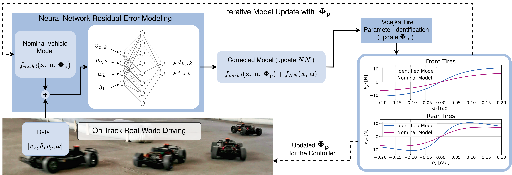

<a href="http://arxiv.org/abs/2411.17508">
    
</a>

On-track system identification is a data-driven approach to identifying tire-dynamics by simply driving around. Check out our preprint [Learning-Based On-Track System Identification for Scaled Autonomous Racing in Under a Minute](https://arxiv.org/abs/2411.17508) on ArXiv for more information. Or check out our explanatory [Youtube video](https://www.youtube.com/watch?v=4kLpSiZoAsE&feature=youtu.be).



## Introduction

This node aims to identify the pacejka tire model of a vehicle with on-track data. It utilizes a neural network to learn model error in a nominal vehicle model. Combining the trained neural network and the nominal model, it generates steady state data and identifies Pacejka parameters from the generated data. This process is done iteratively to improve the vehicle model until the model converges.
The identified parameters are then used to generate a Look-Up Table (LUT) for the MAP controller.

## Installation
On-Track SysID is part of the [ForzaETH Race Stack](https://github.com/ForzaETH/race_stack). Please refer to the [installation guide](https://github.com/ForzaETH/race_stack/blob/main/INSTALLATION.md) for detailed instructions and perform the quickstart guide below to run the sysid procedure.

## Usage (Detailed)

To use this node, follow these steps:

1. **Modify Parameters**:
   - Ensure the vehicle's model parameters are correctly set in the file:
     `race_stack/system_identification/on_track_sys_id/src/models/(racecar_version)/(racecar_version)_pacejka.txt` 
     
     The required parameters are:

        - `I_z`: Moment of inertia about the vehicle's vertical axis (kg.m^2).
        - `h_cg`: Height of the vehicle's center of gravity (m).
        - `l_f`: Distance from the center of gravity to the front axle (m).
        - `l_r`: Distance from the center of gravity to the rear axle (m).
        - `l_wb`: Wheelbase of the vehicle (m).
        - `m`: Mass of the vehicle (kg).
        - `model_name`: Name of the vehicle model (e.g., NUC5).
        - `tire_model`: Type of tire model used (e.g., pacejka).

        Example:
        ```yaml
        I_z: 0.0627
        h_cg: 0.02
        l_f: 0.165
        l_r: 0.155
        l_wb: 0.32
        m: 3.7
        model_name: NUC5
        tire_model: pacejka
        ```
        (Identified pacejka parameters will also be written to this file after training, the pacejka parameters that exist here prior to training are not important.)
    - (Optional) Inside `race_stack/system_identification/on_track_sys_id/src/params/nn_params.yaml` file, you can adjust the following parameters:
    
        - `data_collection_duration` (IMPORTANT): Duration of data collection in seconds. The default is 50 seconds, which is sufficient in most cases. It can be increased more if time is not limited.
        - `num_of_iterations`: Number of iterations for training. The default is 6 iterations. If the model is not converging after 6th iteration, it can be increased.
        - `num_of_epochs`: Number of epochs for training at each iteration. The default is 100 epochs.
        - `lr`: Learning rate for training. The default is 0.0005.
        - `weight_decay`: Weight decay parameter. The default is 0.0.

    - (Optional) Inside `race_stack/system_identification/on_track_sys_id/src/params/pacejka_params.yaml` file, you can adjust the following parameters:

        - `pacejka_model`: Initial values for the Pacejka tire model parameters. These can be left as they are, as convergence does not depend on initial parameters. However, you can adjust them if you have an initial guess for the parameters.
        - `pacejka_ref`: Reference Pacejka parameters are not used in training but plotted in figures for comparison purposes. It can help evaluate the identified Pacejka model. For example, if the surface you want to identify the Pacejka model on has less grip than a known surface, you would expect the identified Pacejka model to have smaller lateral forces, etc.

2. **Launch the Node**: After launchning base_system.launch and time_trials.launch, execute the following command to launch the node along with the required parameters:

    ```bash
    roslaunch stack_master sys_id.launch save_LUT_name:=<save_LUT_name> plot_model:=<True/False>
    ```

    - The `save_LUT_name` parameter specifies the name of the Lookup Table (LUT) that will be saved. By default, it's set to "NUCx_on_track_pacejka".
    - The `plot_model` parameter specifies whether to plot the model evolution at each iteration. If set to `False`, only the Pacejka model in the last iteration will be plotted. If `True`, the identified Pacejka model will be plotted at the end of each iteration.

3. **Drive the Car**: Drive the car at its maximum possible speed without collision to collect data. Driving at its maximum speed will provide data with a high range of slip angles, so the identified pacejka model will be better also at higher slip angles.

4. **Monitor the Progress**: 
    - Launching the node will start data collection for the specified amount of time (only saves the data when longitudinal velocity is higher than 1m/s). 
    - The terminal will display the progress of data collection and training. Follow the instructions on the screen to proceed. 
    - You will be prompted to press 'Y' to export the collected data.

5. **Move the Lookup Table**: 
    - After identifying Pacejka model parameters, a LUT will automatically be generated in `race_stack/system_identification/on_track_sys_id/src/models/(racecar_version)/`
    - Move this lookup table into `race_stack/system_identification/steering_lookup/cfg/`.
    - New LUT can be used after relaunching time trials with the new LUT name.
6. (OPTIONAL) **Repeat**: Repeat all the steps if you can drive the car faster than before with the new generated LUT and you think going even faster is possible with a better model. This would presumably provide a better model that covers higher ranges of slip angles more accurately.

## Physics-Informed Training (Implemented) + Ablation Switch

This repository now includes a physics-informed training option for the residual NN, together with an ablation switch so you can compare it directly against the original MSE-only training.

### What was implemented

1. **Ablation switch in `nn_params.yaml`**
    - `loss_mode: mse` -> original baseline behavior.
    - `loss_mode: physics_informed` -> composite physics-informed loss.

2. **Composite physics-informed loss terms**
    - **Data term (`L_data`)**: same residual MSE used before.
    - **Steady/dynamics consistency term (`L_steady`)**: penalizes mismatch with lateral and yaw dynamics consistency using the bicycle model + Pacejka forces.
    - **Symmetry term (`L_symmetry`)**: enforces left/right mirrored consistency (compatible with the existing mirrored-data augmentation).
    - **Smoothness term (`L_smoothness`)**: penalizes high sensitivity of residual outputs to input perturbations.

3. **Configurable weights and thresholds**
    - `physics_loss.lambda_steady`
    - `physics_loss.lambda_symmetry`
    - `physics_loss.lambda_smoothness`
    - `physics_loss.steady_vy_dot_threshold`
    - `physics_loss.steady_omega_dot_threshold`

4. **Training logs for interpretability**
    - During training, the selected `loss_mode` is printed.
    - In `physics_informed` mode, final per-iteration component losses are printed (`data`, `steady`, `symmetry`, `smoothness`).

### Equations used in `physics_informed` mode

The implemented total loss is:

$$
\mathcal{L}_{total} = \mathcal{L}_{data} + \lambda_{steady}\,\mathcal{L}_{steady} + \lambda_{sym}\,\mathcal{L}_{sym} + \lambda_{smooth}\,\mathcal{L}_{smooth}
$$

where:

1. **Data term (residual learning target)**

$$
\mathcal{L}_{data} = \frac{1}{N}\sum_{k=1}^{N}\left\|\hat e_k - e_k\right\|_2^2,
\quad
\hat e_k = \begin{bmatrix}\hat e_{v_y,k} \\ \hat e_{\omega,k}\end{bmatrix}
$$

2. **Steady/dynamics consistency term**

Using the corrected one-step prediction from nominal model + NN residual:

$$
v_{y,k+1} = v^{nom}_{y,k+1} + \hat e_{v_y,k},
\quad
\omega_{k+1} = \omega^{nom}_{k+1} + \hat e_{\omega,k}
$$

and finite-difference rates:

$$
\dot v_{y,k} \approx \frac{v_{y,k+1}-v_{y,k}}{T_s},
\quad
\dot\omega_k \approx \frac{\omega_{k+1}-\omega_k}{T_s}
$$

the residual dynamics constraints are:

$$
r^{lat}_k = m\dot v_{y,k} + m v_{x,k}\omega_{k+1} - \left(F_{y,r,k} + F_{y,f,k}\cos\delta_k\right)
$$

$$
r^{yaw}_k = I_z\dot\omega_k - \left(F_{y,f,k}l_f\cos\delta_k - F_{y,r,k}l_r\right)
$$

and the implemented steady loss is:

$$
\mathcal{L}_{steady} = \mathbb{E}\left[(r^{lat}_k)^2 + (r^{yaw}_k)^2\right]
$$

optionally masked to near-steady samples using `steady_vy_dot_threshold` and `steady_omega_dot_threshold`.

3. **Symmetry term (left/right consistency)**

For mirrored state/input
$x_k'=[v_x, -v_y, -\omega, -\delta]$:

$$
\mathcal{L}_{sym} = \mathbb{E}\left[\left\|f_{NN}(x_k) + f_{NN}(x_k')\right\|_2^2\right]
$$

4. **Smoothness term (regularized sensitivity)**

$$
\mathcal{L}_{smooth} = \mathbb{E}\left[\left\|\nabla_x \hat e_{v_y}(x)\right\|_2^2 + \left\|\nabla_x \hat e_{\omega}(x)\right\|_2^2\right]
$$

5. **Pacejka lateral force used in the dynamics term**

$$
F_y(\alpha) = F_z D\,\sin\!\left(C\,\arctan\!\left(B\alpha - E\left(B\alpha-\arctan(B\alpha)\right)\right)\right)
$$

### Symbols

- $v_x, v_y$: longitudinal and lateral velocity
- $\omega$: yaw rate
- $\delta$: steering angle
- $m$: vehicle mass
- $I_z$: yaw inertia
- $l_f, l_r$: CoG distances to front/rear axle
- $T_s$: sampling time
- $F_{y,f}, F_{y,r}$: front/rear lateral tire forces

### References

1. Dikici et al., *Learning-Based On-Track System Identification for Scaled Autonomous Racing in Under a Minute*, arXiv:2411.17508, 2024. https://arxiv.org/abs/2411.17508
2. Pacejka and Bakker, *The Magic Formula Tyre Model*, Vehicle System Dynamics, 1992.
3. Chrosniak et al., *Deep Dynamics: Vehicle Dynamics Modeling with a Physics-Constrained Neural Network for Autonomous Racing*, arXiv:2312.04374, 2023. https://arxiv.org/abs/2312.04374
4. Raissi et al., *Physics Informed Deep Learning (Part I)*, arXiv:1711.10561, 2017. https://arxiv.org/abs/1711.10561

### How to use the ablation

Edit `On-Track-SysID/params/nn_params.yaml`:

```yaml
loss_mode: mse  # or: physics_informed

physics_loss:
  lambda_steady: 0.1
  lambda_symmetry: 0.05
  lambda_smoothness: 0.0001
  steady_vy_dot_threshold: 0.8
  steady_omega_dot_threshold: 6.0
```

### Suggested experiment protocol

Run two experiments on the same dataset and setup:

1. `loss_mode: mse` (baseline)
2. `loss_mode: physics_informed` (proposed)

Then compare:

- One-step prediction metrics (`v_y`, `omega` RMSE)
- Identified Pacejka parameters over iterations
- Closed-loop performance (lap time / tracking quality)

### Important YAML note

Use **spaces** for indentation in `nn_params.yaml` (do not use tabs), otherwise YAML parsing will fail at runtime.

## Usage (Short)
 - Make sure `race_stack/system_identification/on_track_sys_id/src/models/(racecar_version)/(racecar_version)_pacejka.txt` exist with correct parameters.

 - Launch sys_id.launch
  ```bash
  roslaunch stack_master sys_id.launch save_LUT_name:=<save_LUT_name> plot_model:=<True/False>
  ```
 - Drive the car with a controller until data collection is done.
 - Move generated lookup table to `race_stack/system_identification/steering_lookup/cfg/`. 
 - Relaunch time trials.

## Files and Directory Structure

- `on_track_sys_id.py`: This is the main Python script that contains the main node responsible for collecting data, calling training, exporting data, and more.

- `nn_train.py`: This script handles neural network training. It is called from the main script. It trains a neural network, identifies Pacejka parameters, and calls `simulate_model.py` to generate the Look-Up Table (LUT).

- `simulate_model.py`: This script generates a Look-Up Table (LUT) from the identified Pacejka model parameters.

- `dynamics/`: This directory contains vehicle dynamics used for Look-Up Table (LUT) generation.

- `data/`: This directory stores collected data if exported.

- `model/`: Directory containing vehicle models.

- `params/`: Directory containing YAML files for model parameters.

- `helpers/`: Directory containing helper functions and modules.
    - `pacejka_formula.py`: Module to calculate lateral tire forces using Pacejka tire model.
    - `plot_results.py`: Module to plot the system identification results.
    - `generate_inputs_errors.py`: Module to generate input tensors and target error tensors for neural network training.
    - `generate_predictions.py`: Module to generate predictions for the next step's lateral velocity and yaw rate.
    - `load_model.py`: Module to load vehicle model params from `model/`.
    - `save_model.py`: Module to save pacejka model parameters to corresponding txt files in `model/`.
    - `SimpleNN.py`: Module defining the structure of the neural network.
    - `solve_pacejka.py`: Module to solve for Pacejka tire model coefficients.

## Citing On Track SysID

If you found our stack helpful in your research, we would appreciate if you cite it as follows:
```
@misc{dikici2024learningbasedontrackidentificationscaled,
      title={Learning-Based On-Track System Identification for Scaled Autonomous Racing in Under a Minute}, 
      author={Onur Dikici and Edoardo Ghignone and Cheng Hu and Nicolas Baumann and Lei Xie and Andrea Carron and Michele Magno and Matteo Corno},
      year={2024},
      eprint={2411.17508},
      archivePrefix={arXiv},
      primaryClass={cs.RO},
      url={https://arxiv.org/abs/2411.17508}, 
}
```
