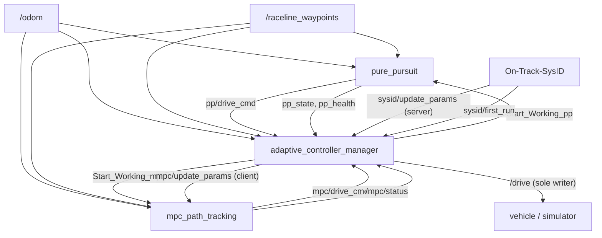
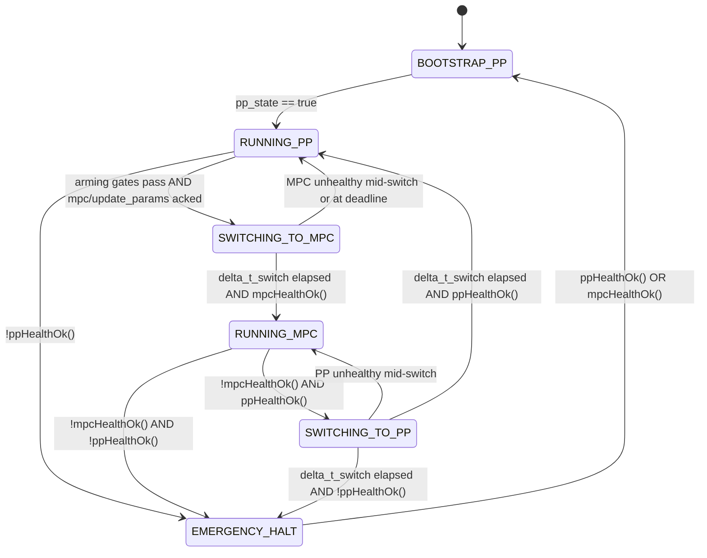
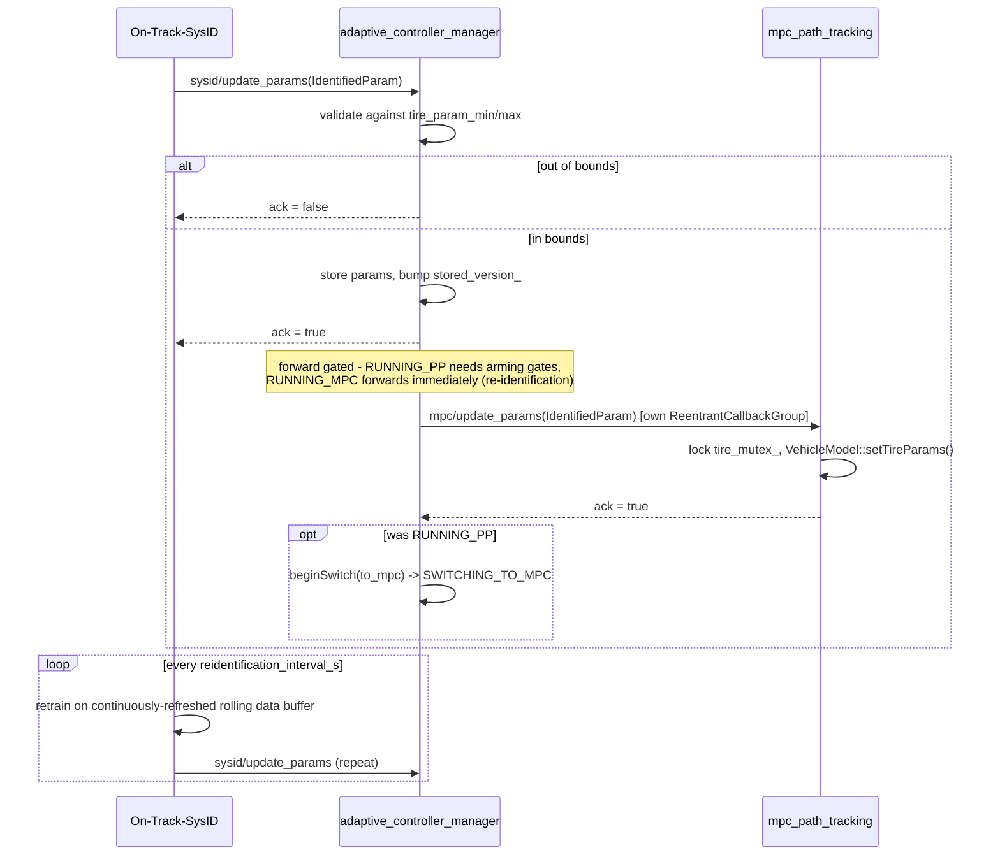

# adaptive_controller_manager

Arbiter/FSM node mediating between `pure_pursuit` (bootstrap/fallback controller) and `mpc_path_tracking` (advanced controller, once tire parameters are identified), and mediating tire-parameter handoff between `On-Track-SysID` and `mpc_path_tracking`. Implements the design in `enhanced_controller_plan.md`, corrected and hardened against the real F1TENTH simulator during integration testing (see "Corrections found via integration testing" throughout, and the summary in §8).

## 1. Overview

Before this package existed, `pure_pursuit` and `mpc_path_tracking` each published their drive command straight to `/drive`, with no coordination, no health monitoring, and no automated handover — running both together meant two independent, uncoordinated publishers on the same topic. `f1tenth_simulator/node/mux.cpp` is prior art for the general arbiter *pattern* (private per-source topic in, single shared topic out, hardcoded zero-command failsafe when nothing is active) but is not actually single-writer itself: `Mux` and each of its `Channel` instances hold independent publishers all bound to `/drive`.

`adaptive_controller_manager` is the sole writer to `/drive` in this stack. `pure_pursuit` and `mpc_path_tracking` instead publish to private topics (`pp/drive_cmd`, `mpc/drive_cmd`); the manager arbitrates between them, drives a bootstrap → identify → handover → fallback state machine, and mediates the online tire-parameter handoff from `On-Track-SysID` to `mpc_path_tracking`.

## 2. Architecture



Every arrow above is a real topic/service in the running graph (verified with `ros2 topic list` / `ros2 node info` during integration testing — see §8).

## 3. Finite state machine



This matches `manager_node.cpp`'s `controlLoop()`/`stepSwitching()`/`tryForwardStoredParams()` exactly, not the original draft plan — two transitions were corrected after being caught by integration testing:

**Correction 1 — `RUNNING_PP`'s emergency check.** `mpc_path_tracking` keeps solving and publishing `/mpc/status` even while gated off (`Start_Working_mpc == false`), so `mpcHealthOk() == true` only ever means *the solver works*, not *MPC is a validated, instantly-usable fallback*. The original logic was `if (!ppHealthOk() && !mpcHealthOk())` — since MPC's idle solver is almost always healthy, killing `pure_pursuit` alone in `RUNNING_PP` never reached `EMERGENCY_HALT`; the manager silently stayed in `RUNNING_PP` while `/drive` quietly zeroed out via the stale-data fallback in `computeOutput()`. Fixed to `if (!ppHealthOk())` only — PP is the sole *active* controller in this state, and promoting an idle, never-armed MPC without going through the normal arming gates would skip the safety checks entirely.

**Correction 2 — `RUNNING_MPC`'s fallback check.** Symmetrically, `if (!mpcHealthOk())` used to unconditionally `beginSwitch(false)` (attempt a switch to PP), even if PP was *also* unhealthy at that moment. Fixed to check `ppHealthOk()` first: switch to PP only if PP is actually healthy, otherwise go straight to `EMERGENCY_HALT` (Safety 5B — both controllers unhealthy simultaneously).

## 4. Safety gates

All thresholds are `adaptive_controller_manager/config/adaptive_controller_manager.yaml`:

**1A — speed.** `v_x > v_min` (`0.5` m/s), from `/odom` twist — below this, remain in Pure Pursuit.

**1B — track alignment**, from `track_geometry_utils::computeTrackError()` (independent of whether `mpc_path_tracking` is running):
```
|e_y|           < e_y_max     (0.1 m)
|heading_error| < theta_max   (0.3 rad)
```
`theta_max` was originally planned as an illustrative `0.1 rad`. Live testing on YasMarina showed `pure_pursuit`'s own heading error (it minimizes lookahead-point lateral geometry, not heading directly) has a **median |heading_error| ≈ 0.09 rad and a p90 ≈ 0.25 rad** under ordinary driving — `0.1` would essentially never arm. Retuned to `0.3 rad` (comfortably above the observed p90) from this measurement.

**2A — MPC solver health.** `mpc_health := (/mpc/status.level == DiagnosticStatus::OK)`. `mpc_path_tracking` derives this straight from whether its last QP solve succeeded, regardless of whether it's actively driving (§3, Correction 1) — so the manager additionally requires the topic itself to be *fresh* (see `mpcHealthOk()` below), not just the last-cached value, so a crashed `mpc_node` process is detected rather than trusted forever on a stale reading.

**2B — data freshness.** `Δt` since last `/odom` `< delta_t_state_max` (`0.1` s). Stale data blocks arming.

**3 — error convergence.** A rolling window (`error_convergence_window = 20` samples) of per-tick `d(e_y)/dt` estimates; their running average must be `< 0` before arming — don't hand over into an already-diverging error.

**5A — controller-silence timeout.** `delta_t_timeout = 1.0` s: if the active controller's own health/state topic goes silent for this long, `ppHealthOk()`/`mpcHealthOk()` return false (implemented as `has_X && (now() - last_X_stamp).seconds() < delta_t_timeout`), triggering the relevant fallback.

**5B — both unhealthy → `EMERGENCY_HALT`.** Hardcoded zero-throttle, zero-steering `/drive`, published every tick until at least one controller recovers, then back to `BOOTSTRAP_PP`.

Tire-parameter plausibility bounds (`tire_param_min`/`tire_param_max`, fixed order `[Bf,Cf,Df,Ef,Br,Cr,Dr,Er]`) are coarse sanity bounds meant to catch a grossly wrong identification (NaN, sign flip, orders of magnitude off) — not a validated physical range, and worth retuning per vehicle.

## 5. Handover mechanics

Steering switches instantly (forwarded unmodified from the newly-active controller); speed is ramped. At the switch instant, `beginSwitch()` freezes the outgoing controller's last commanded speed (`v_frozen_`); only the newly active controller runs from then on (single-writer, no dual-controller concurrent execution):

```
v_cmd(t) = (1 - α(t)) * v_frozen + α(t) * v_new(t)
α(t) = clamp(t / delta_t_switch, 0, 1)          # linear ramp over delta_t_switch
```

Two hardenings beyond the original draft, both added deliberately (not literal-draft-compliant, but load-bearing for a safety-critical handover):

- **Bridge before the incoming controller's first command.** `Start_Working_mpc`/`Start_Working_pp` take effect on the *target* node's own next tick — for at least one manager tick after `beginSwitch()`, the newly-active controller may not have published anything yet. `computeOutput()` holds the previous tick's output (`last_output_cmd_`) rather than publish a stale/garbage command, until the incoming controller's first fresh command actually arrives (its timestamp `>= switch_start_time_`). Bounded by `delta_t_switch` regardless (see `stepSwitching()` — once the window elapses, it resolves definitively one way or another, never holds indefinitely).
- **Decrease-only deceleration rate limit.** Any speed *decrease* from the previous tick's published value — whether from the ramp blend, `EMERGENCY_HALT`'s hardcoded zero, or the stale-data fallback — is capped to `max_decel_mps2` (`8.26` m/s², matching `f1tenth_simulator`/`mpc_path_tracking`'s existing physical deceleration limit) rather than allowed to step to a lower value instantly:
  ```cpp
  if (cmd.drive.speed < last_output_cmd_.drive.speed) {
    const double min_allowed = last_output_cmd_.drive.speed - max_decel_mps2 * dt;
    cmd.drive.speed = std::max(cmd.drive.speed, min_allowed);
  }
  ```
  Verified directly: stepping a commanded speed from 5.0 to 0.0 produced `5.0 → 4.587 → 4.174 → ... → 0.044 → 0.0`, decrementing by exactly `8.26 * (1/20Hz) = 0.413` m/s per tick — an instant full stop never reaches the vehicle. Increases are left unclamped (the ramp already blends smoothly upward, and each controller's own accel limits apply otherwise).

## 6. Parameter handoff



`On-Track-SysID` originally published a one-shot latched `/sysid/training_complete` (`std_msgs/String`) exactly once, ever — no continuous re-identification loop existed. Replaced with the service-based loop above plus a periodic timer (`reidentification_interval_s`, default `30.0`s): `collect_data()` now runs every tick regardless of phase (keeping the rolling buffer fresh), and a non-blocking future (`call_async` + polled `future.done()` across ticks, never a blocking `spin_until_future_complete` from inside the single-threaded node's own timer callback, which would deadlock) drives retraining and resubmission.

`mpc_path_tracking`'s tire params live inside `MpcController`'s own `VehicleModel` copy (constructed by-value in `MpcController`'s constructor), **not** the `VehicleModel` instance `MpcNode` originally constructs — a service handler that updated the latter would have had zero effect on the solver. `mpc/update_params`'s handler calls `controller_->setTireParams(tire)`, which forwards to that inner copy; verified live via direct service call, confirmed in `mpc_node`'s log (`tire params updated via mpc/update_params`) and via the `VehicleModel` copy constructor/assignment, which had to be added explicitly once a `std::mutex` (guarding concurrent reads from the control-loop thread against writes from the service's `ReentrantCallbackGroup` thread) made `VehicleModel` non-copyable by default.

## 7. Package interfaces

| | Topic/Service (parameter) | Type | Notes |
|---|---|---|---|
| Sub | `odom_topic` (`/odom`) | `nav_msgs/msg/Odometry` | feeds `track_geometry_utils`, `v_min`/freshness gates |
| Sub | `waypoint_topic` (`/raceline_waypoints`) | `f1tenth_msgs/msg/WaypointArray`, `TRANSIENT_LOCAL` | feeds `track_geometry_utils` |
| Sub | `pp_drive_topic` (`pp/drive_cmd`) | `ackermann_msgs/msg/AckermannDriveStamped` | from `pure_pursuit` |
| Sub | `mpc_drive_topic` (`mpc/drive_cmd`) | `ackermann_msgs/msg/AckermannDriveStamped` | from `mpc_path_tracking` |
| Sub | `pp_state_topic`/`pp_health_topic` (`pp_state`/`pp_health`) | `std_msgs/msg/Bool` | from `pure_pursuit` |
| Sub | `mpc_status_topic` (`/mpc/status`) | `diagnostic_msgs/msg/DiagnosticStatus` | `mpc_health := level == OK` |
| Sub | `sysid_first_run_topic` (`sysid/first_run`) | `std_msgs/msg/Bool`, `TRANSIENT_LOCAL` | informational |
| Pub | `drive_topic` (`/drive`) | `ackermann_msgs/msg/AckermannDriveStamped` | **sole writer** in the stack |
| Pub | `start_working_pp_topic`/`start_working_mpc_topic` (`Start_Working_pp`/`Start_Working_mpc`) | `std_msgs/msg/Bool` | gates each controller's own publish |
| Pub | `manager/state` | `std_msgs/msg/String` | current FSM state, observational |
| Pub | `manager/debug/lateral_error`, `manager/debug/heading_error` | `std_msgs/msg/Float64` | mirrors `mpc_path_tracking`'s own `/mpc/debug/*` pattern |
| Pub | `manager/active_controller_marker` | `visualization_msgs/msg/MarkerArray` | colored sphere + text label hovering above the vehicle in RViz - green "PURE PURSUIT", blue "MPC", orange "SWITCHING -> ...", red "EMERGENCY HALT" |
| Srv (server) | `sysid_update_params_service` (`sysid/update_params`) | `adaptive_controller_interfaces/srv/IdentifiedParam` | validates bounds, stores |
| Srv (client) | `mpc_update_params_service` (`mpc/update_params`) | `adaptive_controller_interfaces/srv/IdentifiedParam` | forwards validated params |

All names above are ROS parameters — see `config/adaptive_controller_manager.yaml`.

## 8. Integration test results

Run via `adaptive_controller_manager/test/sim_integration_test.sh` against `f1tenth_simulator` on **YasMarina** (moderate corners). Sochi (tight low-speed corners, stresses `v_min`/alignment gates) and Monza (long straights, stresses bootstrap→arm at high approach speed) are recommended follow-up soak tests, not yet run.

All 3 scenarios passed (14/14 checks) on the run this doc is based on:

| Check | Result |
|---|---|
| `BOOTSTRAP_PP → RUNNING_PP` | reached in 1-3s |
| PP-only driving, 15s | no NaN/Inf, max `\|speed\|` 8.55 m/s |
| Arming gates pass (real PP tracking, no synthetic assist) | `RUNNING_PP → SWITCHING_TO_MPC` in ~3s after param injection |
| `SWITCHING_TO_MPC → RUNNING_MPC` | +1s (matches `delta_t_switch = 1.0s`) |
| MPC-only driving, 15s | no NaN/Inf, max `\|speed\|` 7.0 m/s, lateral error ~0.0008 m |
| `/drive` publisher count throughout | exactly 1 |
| Killed `mpc_node` mid-`RUNNING_MPC` → fallback | `SWITCHING_TO_PP` within 2s |
| Killed `pure_pursuit` (both then unhealthy) → `EMERGENCY_HALT` | within 3s, `/drive` confirmed zero/zero |
| Restarted `pure_pursuit` → recovery | `EMERGENCY_HALT → BOOTSTRAP_PP` confirmed |

**Two real bugs were caught and fixed by this testing pass, neither visible from code review alone:**

1. **Launch-argument namespace collision.** `pure_pursuit.launch.py` and `mpc_path_tracking.launch.py` both declare identically-named arguments (`config_file`, `drive_topic`). `ros2 launch`'s `DeclareLaunchArgument` is idempotent — the first include's declaration wins for any name not explicitly passed via that include's own `launch_arguments=`. Since `adaptive_stack.launch.py` includes `pure_pursuit` first, `mpc_node` silently inherited `drive_topic = "pp/drive_cmd"` instead of its own `"mpc/drive_cmd"` — its own log line even printed the wrong value (`drive=pp/drive_cmd`). Net effect: `mpc/drive_cmd` never received a message, so once `RUNNING_MPC`, `/drive` silently held at zero speed for the entire window (the car sat still, confirmed via `/odom` position not moving at all over 10s) even though `/mpc/status` reported a healthy solve throughout. Fixed by explicitly passing `config_file` and `drive_topic` (each package's own value) via `launch_arguments=` for both includes.
2. **FSM Corrections 1 & 2 in §3** — both caught the same way: a scenario that should have reached `EMERGENCY_HALT` silently didn't, because MPC's idle-but-solving-fine health was being treated as an instantly-usable fallback.

## 9. How to run

### Build
```bash
source /opt/ros/humble/setup.bash
cd /home/ebrahim/Ebrahim_Master_Thesis_repo
colcon build --symlink-install --packages-up-to adaptive_controller_manager
source install/setup.bash
```

### Launch the full managed stack (no simulator)
```bash
ros2 launch adaptive_controller_manager adaptive_stack.launch.py
```

### Launch against the simulator (test bringup)
```bash
ros2 launch adaptive_controller_manager sim_test.launch.py map_name:=YasMarina
```

### Run the integration test
```bash
./adaptive_controller_manager/test/sim_integration_test.sh
```
Runs all 3 scenarios end-to-end with full process cleanup verified between each; exits non-zero on the first failed check.

### Inspect at runtime
```bash
ros2 topic echo /manager/state                    # current FSM state
ros2 topic echo /manager/debug/lateral_error       # e_y feeding the arming gate
ros2 topic info /drive --verbose                   # confirm single-writer
ros2 service call /sysid/update_params adaptive_controller_interfaces/srv/IdentifiedParam \
  "{param_values: [2.4128, 4.8155, 0.5922, 5.0, 14.4445, 1.2129, 0.6842, 0.8526]}"
```

### Visualize the active controller in RViz

Add a `MarkerArray` display subscribed to `/manager/active_controller_marker` (Fixed Frame `map`). Shows a colored sphere + text label hovering above the vehicle: green "PURE PURSUIT", blue "MPC", orange "SWITCHING -> ...", gray "BOOTSTRAP", red "EMERGENCY HALT".

### Follow the manager's flow/status

The manager logs a throttled (every 2s) one-line summary covering both controllers, so its own console output is enough to follow what's happening without cross-referencing `pure_pursuit`'s/`mpc_path_tracking`'s separate logs:
```
[status] state=RUNNING_PP | pp: health=ok state=active | mpc: health=ok | v_x=6.62 e_y=-0.456 theta=0.275 | params: stored_v=0 fwd_v=0 pending=no
```
When a stored (validated) tire submission is waiting on the arming gates in `RUNNING_PP`, a second throttled line names exactly which gates are still failing (`v_min`, `e_y_max`, `theta_max`, `convergence`, `odom_stale`, `no_track_error`) - this is the fastest way to diagnose "identification finished but it hasn't switched to MPC yet" (see §10).

## 10. Troubleshooting

**"Identification finishes but it never switches to MPC."** Not a code bug in any case reproduced so far — every occurrence traced back to a leftover stack from a previous launch still running. `ros2 launch`'s Ctrl-C doesn't always cleanly tear down every nested process (`nav2` lifecycle nodes in particular), so a second launch's nodes end up sharing the same global topic names (`/odom`, `/raceline_waypoints`, `/drive`, ...) with ghosts from the first. Two publishers latched on `/raceline_waypoints` means the manager's `track_geometry_utils::computeTrackError()` alternates between fresh and stale waypoint data tick to tick — `lateral_error` was observed swinging between ~0 and -115 m, which permanently fails the `e_y_max` arming gate (§4) since it's never consistently small.

Tell-tale sign:
```
$ ros2 node list
WARNING: Be aware that there are nodes in the graph that share an exact name, which can have unintended side effects.
```
or `ros2 topic info /raceline_waypoints --verbose` showing `Publisher count: 2` (should always be 1).

Fix: kill every stack process before relaunching, then reset the discovery cache:
```bash
pkill -INT -f "ros2 launch"; sleep 2
pkill -9 -f "adaptive_controller_manager_node|mpc_path_tracking/mpc_node|pure_pursuit/pure_pursuit_node.py|on_track_sys_id.py|f1tenth_simulator|track_publisher.py|map_server|lifecycle_manager|robot_state_publisher"
ros2 daemon stop && ros2 daemon start
ros2 node list   # must be empty before relaunching
```
A genuinely clean run reaches `RUNNING_MPC` reliably: identification completes, the manager stores params immediately, waits only as long as it takes the arming gates to actually pass (observed ~6 s under normal PP tracking), forwards to MPC, and completes the switch in exactly `delta_t_switch` (1.0 s) after that.

**"Params keep getting rejected / silently never switching, even with a clean single stack."** Check `tire_param_min`/`tire_param_max` in `config/adaptive_controller_manager.yaml` against what's actually being identified — the shipped defaults were a coarse guess (`D <= 3.0`), but live YasMarina identifications routinely produced rear `Dr` values of 4.8-7.1 (front `Df` up to 20) - well past that guess. The manager logs the exact rejection with the offending index/value/bounds (`sysid/update_params: param[N]=... outside plausible bounds [...] - rejected`) - if you see this repeating, widen that specific bound rather than assume it's a logic bug.

**"RViz shows nothing on `manager/active_controller_marker`."** The publisher/topic side was verified working (20 Hz, correct `map` frame, TF resolves) - if RViz shows nothing with no error, it's almost always a **QoS durability mismatch**: the `MarkerArray` display's Topic settings default to whatever the *previous* MarkerArray display in the same RViz session used (or whatever you copy-pasted), and this stack's other `/raceline_waypoints_markers` display is `Transient Local`. `manager/active_controller_marker` is plain **Volatile** (it's continuously republished at 20 Hz, not latched) - a Volatile publisher can't satisfy a Transient-Local-requesting subscriber, and DDS drops the match silently (no dialog, no red text). Fix: set the display's Durability Policy to `Volatile`, or just use the pre-configured `ActiveController` display already in `f1tenth_simulator/launch/simulator.rviz`.
