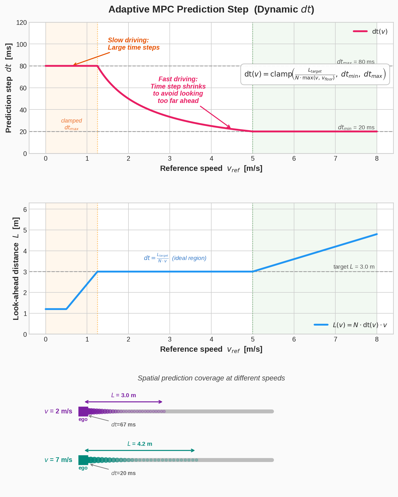
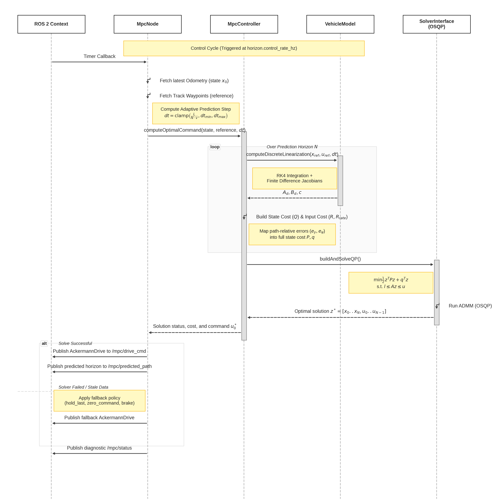

# mpc_path_tracking

LTV-MPC (linear time-varying model predictive control) path-tracking controller for the F1TENTH racecar, using a dynamic bicycle model with a Pacejka/Magic Formula tire model. Interfaces like `pure_pursuit` (same odometry/raceline inputs, same Ackermann-drive output contract) so it can be swapped in through the existing simulator mux.

This is Stage 1 of a two-stage plan (see `mpc_plan.md`): a linear-time-varying MPC solved as a QP with OSQP. Stage 2 (full nonlinear NMPC via ACADOS) is not implemented yet; `solver_interface` is factored so that swap doesn't require touching the rest of the controller.

## Notation

| Symbol | Description | Unit |
|--------|-------------|------|
| **State vector** |||
| `X`, `Y` | Vehicle position in the world/map frame | m |
| `ψ` (`psi`) | Vehicle heading (yaw angle) in the world frame | rad |
| `vx` | Longitudinal velocity in body frame | m/s |
| `vy` | Lateral velocity in body frame | m/s |
| `r` | Yaw rate | rad/s |
| **Input vector** |||
| `δ` (`delta`) | Front steering angle command | rad |
| `a` | Longitudinal acceleration command at the CG | m/s² |
| **Vehicle parameters** |||
| `m` | Vehicle mass | kg |
| `Iz` | Yaw moment of inertia | kg·m² |
| `l_f` | Distance from CG to front axle | m |
| `l_r` | Distance from CG to rear axle | m |
| `h_cg` | Height of center of gravity | m |
| `g` | Gravitational acceleration (9.81) | m/s² |
| **Tire model (Pacejka / Magic Formula)** |||
| `α_f`, `α_r` (`alpha_f`, `alpha_r`) | Front / rear slip angles | rad |
| `Fy_f`, `Fy_r` | Front / rear lateral tire forces | N |
| `Fz_f`, `Fz_r` | Front / rear normal (vertical) loads | N |
| `B_i` | Pacejka stiffness factor (per axle `i ∈ {f, r}`) | — |
| `C_i` | Pacejka shape factor | — |
| `D_i` | Pacejka peak factor (dimensionless, multiplies `Fz`) | — |
| `E_i` | Pacejka curvature factor | — |
| **MPC horizon & timing** |||
| `N` | Number of prediction steps | — |
| `dt` | Prediction time step (adaptive) | s |
| `dt_min`, `dt_max` | Bounds on the adaptive prediction step | s |
| `horizon_distance_m` | Target look-ahead distance for the adaptive `dt` formula | m |
| `v_floor` | Minimum speed used in adaptive `dt` denominator | m/s |
| **Cost & weights** |||
| `Q` | Stage cost weight vector on path-relative error `e_k` (5 diagonal entries) | — |
| `Qf` | Terminal cost weight vector (same structure as `Q`) | — |
| `R` | Input cost weight vector `[δ, a]` (2 diagonal entries) | — |
| `R_rate` | Input-rate penalty weight vector `[Δδ, Δa]` (2 diagonal entries) | — |
| **Path-relative error** |||
| `e_y` | Signed lateral deviation from the reference path | m |
| `e_ψ` (`e_psi`) | Heading error relative to path tangent | rad |
| `vx_err` | Speed tracking error (`vx − vx_ref`) | m/s |
| `r_err` | Yaw-rate error (`r − vx_ref · κ_ref`) | rad/s |
| **Reference trajectory** |||
| `X_ref`, `Y_ref` | Reference (raceline) waypoint position | m |
| `ψ_ref` (`psi_ref`) | Reference heading at waypoint | rad |
| `vx_ref` | Reference longitudinal speed at waypoint | m/s |
| `κ_ref` (`kappa_ref`) | Reference path curvature at waypoint | 1/m |
| `s` | Arc-length coordinate along the raceline | m |
| **Linearized discrete-time model** |||
| `Ad`, `Bd` | Discrete-time state and input Jacobians | — |
| `c` | Affine offset ensuring exactness at the linearization point | — |
| `C_k` | Output matrix mapping full state `x_k` to error `e_k` | — |
| **Actuator limits** |||
| `δ_max`, `δ_min` | Steering angle bounds | rad |
| `δ̇_max` | Maximum steering rate | rad/s |
| `a_max` | Maximum longitudinal acceleration | m/s² |
| `a_min` (= −`decel_max`) | Maximum braking deceleration (negative) | m/s² |
| `j_max` | Maximum jerk | m/s³ |
| `v_max`, `v_min` | Speed bounds (applied to the final Ackermann command) | m/s |

## 1. Vehicle model

### States and inputs

State vector (world-frame position/heading, body-frame velocities, yaw rate):

```
x = [X, Y, psi, vx, vy, r]
```

Input vector:

```
u = [delta, a]
```

- `delta`: front steering angle command (rad)
- `a`: longitudinal acceleration command (m/s^2), applied at the CG

### Slip angles

```
alpha_f = delta - atan2(vy + l_f * r, vx)
alpha_r = -atan2(vy - l_r * r, vx)
```

`vx` is clamped to a floor (0.5 m/s) purely for this computation to avoid the `1/vx` singularity near standstill; the clamp never touches the propagated state itself.

This sign convention matters and is not arbitrary: it must match `On-Track-SysID/src/helpers/data_processing.py`'s `compute_slip_angles`, since that's the convention the identified `Bf/Cf/Df/Ef/Br/Cr/Dr/Er` coefficients were fit against. `Fy = D*sin(...)` is an odd function of `alpha`, so getting this sign backwards silently negates the tire force — the naturally stabilizing restoring force becomes destabilizing, invisible at small slip angles but diverging as soon as the car is meaningfully off the reference (this was an actual bug caught during integration testing — see git history).

### Pacejka / Magic Formula lateral tire force

Per axle (front `f`, rear `r`), using identified coefficients `[B, C, D, E]`:

```
Fy_i = Fz_i * D_i * sin( C_i * atan( B_i*alpha_i - E_i*(B_i*alpha_i - atan(B_i*alpha_i)) ) )
```

`D` is a dimensionless peak-friction-like coefficient, not a force — it multiplies the axle normal load `Fz_i`. `alpha_i` is clamped to about ±30° before evaluation to avoid the curve extrapolating into non-physical force reversals.

Static (no load-transfer) normal loads:

```
Fz_f = m * g * l_r / (l_f + l_r)
Fz_r = m * g * l_f / (l_f + l_r)
```

### Continuous-time dynamics

```
Xdot   = vx*cos(psi) - vy*sin(psi)
Ydot   = vx*sin(psi) + vy*cos(psi)
psidot = r
vxdot  = a - (Fy_f * sin(delta)) / m + vy*r
vydot  = (Fy_r + Fy_f*cos(delta)) / m - vx*r
rdot   = (l_f * Fy_f*cos(delta) - l_r * Fy_r) / Iz
```

`a` is treated as the net longitudinal acceleration at the CG (consistent with the simulator's own speed-tracking drivetrain model, the same assumption `pure_pursuit` already relies on for its `drive.speed` command).

### Discretization

- **RK4** integrates the nonlinear dynamics over one control step (`vehicle_model.cpp`, `integrateRk4`).
- **LTV linearization**: at each control cycle, the Jacobians `A = df/dx`, `B = df/du` are computed via central finite differences around a nominal operating point, then discretized as:

```
x_(k+1) ≈ Ad*x_k + Bd*u_k + c
```

where `c` is the affine offset chosen so the affine model reproduces `integrateRk4(x, u, dt)` exactly at the linearization point. Finite differences were chosen over hand-derived analytic partials because the full nonlinear trig + Pacejka model is easy to get subtly wrong by hand, and this is far less error-prone.

The linearization point at each horizon step `k` is taken from the **reference trajectory** itself (not the previous MPC solution): `x_lin = [X_ref, Y_ref, psi_ref, vx_ref, 0, vx_ref*kappa_ref]`, `u_lin = [atan(wheelbase*kappa_ref), 0]`. This means every solve is self-contained — no warm-started nominal trajectory is required, which matters for the very first solve after a raceline is (re)loaded.

## 2. Path-relative error cost

The horizon reference at each stage `k` comes from the raceline (`f1tenth_msgs/WaypointArray`, fields `s_m, x_m, y_m, psi_rad, kappa_radpm, vx_mps`). The cost weights (`Q`, `Qf`) are defined over a 5-element path-relative error vector, not the raw 6-state vector:

```
e_k = [e_y, e_psi, vx_err, vy, r_err]
```

- `e_y = -sin(psi_ref)*(X - X_ref) + cos(psi_ref)*(Y - Y_ref)` — signed lateral deviation from the path
- `e_psi = psi - psi_ref` — heading error (psi_ref unwrapped to stay continuous with the vehicle's current heading, so it never jumps by 2*pi)
- `vx_err = vx - vx_ref` — speed tracking error
- `vy` — lateral velocity (target 0)
- `r_err = r - vx_ref*kappa_ref` — yaw-rate error against the steady-state feedforward yaw rate implied by the path curvature

Because `e_k` is an affine function of the full state `x_k` (`e_k = C_k*x_k - target_k`, with `C_k` depending only on `psi_ref` at that stage), the quadratic cost `e_k^T * diag(Q) * e_k` expands into a standard quadratic-plus-linear cost in `x_k`, which is what actually feeds the QP (`mpc_controller.cpp`, `errorCostMatrices`).

## 3. QP formulation and solver

Each control cycle builds a single sparse QP over the stacked decision vector `z = [x_0, x_1, ..., x_N, u_0, ..., u_(N-1)]`:

```
minimize   sum_k (e_k^T Q e_k)  +  sum_k (u_k^T R u_k)  +  sum_k ((u_k - u_(k-1))^T R_rate (u_k - u_(k-1)))
subject to x_0 = x_current
           x_(k+1) = Ad_k*x_k + Bd_k*u_k + c_k          for k = 0..N-1
           u_min <= u_k <= u_max
           u_rate_min*dt <= u_k - u_(k-1) <= u_rate_max*dt
```

with `u_(-1)` taken as the previously applied command (a fixed parameter, not a decision variable). This is solved with **OSQP** via **osqp-eigen**. OSQP was chosen over qpOASES/IPOPT/CVXGEN because: it's a pure C++ QP solver with no NLP overhead, warm-startable, ADMM-based (robust to poor conditioning), and Eigen-friendly — `f1tenth_simulator` already depends on Eigen3, so this doesn't add a second numerical stack to the workspace. Neither OSQP nor osqp-eigen is packaged anywhere else in this workspace, so they're fetched and built as part of this package's own CMake configure step (see "Build" below).

### Adaptive prediction step

The prediction horizon step `dt` is recomputed every control cycle from the reference speed, not fixed:

```
dt = clamp( horizon_distance_m / (N * max(vx_ref, v_floor)), dt_min, dt_max )
```

This keeps the horizon's *look-ahead distance* roughly constant regardless of speed, while `dt_min`/`dt_max` bound it away from numerically degenerate (too small) or destabilizing (too coarse) values. The internal prediction spacing adapts independently of the outer ROS control-loop rate (`horizon.control_rate_hz`) — but `dt_min` is not free to go arbitrarily low; see below.



**Understanding the Adaptive Prediction Step**

The MPC controller works by predicting exactly `N=30` steps into the future. If the time between these steps (`dt`) was fixed, the look-ahead distance would be dangerously short at low speeds and stretch too far off the track at high speeds. To solve this, we use a *dynamic* time step that shrinks as speed increases—acting like an automatic zoom lens to keep the car focused on the same stretch of road.

* **Top Panel ($dt$ vs Speed):** At slow speeds, the time step is large (clamped at `dt_max=80ms`) to ensure the prediction reaches far enough ahead. As speed increases, the time step smoothly shrinks down to `dt_min=20ms` to prevent the predictions from stretching too far.
* **Middle Panel (Look-ahead Distance vs Speed):** In the ideal driving range (roughly 1.2 m/s to 5 m/s), the dynamic `dt` perfectly balances the speed, resulting in a flat look-ahead distance of exactly 3.0 meters. Above 5 m/s, the time step hits its 20ms safety floor. Because `dt` can no longer shrink to compensate for the higher speed, the look-ahead distance naturally and safely increases, giving the fast-moving car more distance to react to upcoming corners.
* **Bottom Panel (Spatial Coverage):** This demonstrates the physical result. Whether driving at 2 m/s or 7 m/s, the physical coverage of the prediction steps (the dots) remains consistent. The fast car simply executes its steps much more rapidly (every 20ms instead of 67ms) to maintain that coverage.

### Known issue: `dt_min` must not be shorter than the control period

**Symptom:** once the sim settled into normal cruise speed (~6-7 m/s), the steering command developed a self-sustained, growing oscillation (~2.5 Hz, amplitude climbing toward ±0.24 rad) — visibly "shaking" in RViz — while `/mpc/debug/lateral_error` stayed millimeter-scale the whole time. The car wasn't actually off the path; the *control signal* was chattering around a near-perfect solution.

**Root cause:** `computeAdaptiveDt()` floors `dt` at `dt_min` for any `vx_ref > horizon_distance_m / (N * dt_min)` — with the defaults (`horizon_distance_m=3.0`, `N=30`, `dt_min=0.02`) that threshold is `5 m/s`, comfortably below normal cruise speed. So in practice `dt` was pinned at `0.02s` almost the entire lap. But the outer ROS control timer (`horizon.control_rate_hz=20`) only re-solves every `0.05s`. The QP was solved assuming it gets to replan every 20ms and re-measure the true state; in reality `u0` is held for 50ms — 2.5x longer than the model that computed it assumed. This model/actuation-duration mismatch is what produced the chatter: because `Q` on `e_y`/`e_psi` dominates the cost and `R`/`R_rate` are small relative to it, a low-amplitude control wobble costs the QP almost nothing, so nothing in the objective pushed back against it — it went unnoticed in tracking-error telemetry and only showed up as steering shake.

**Fix:** `dt_min` must always be `>= 1/control_rate_hz`. This is no longer left as a yaml convention to remember — `ParameterManager::mpcConfig()` (`parameter_manager.cpp`) computes `control_period_s = 1/control_rate_hz` at startup, raises `dt_min` (and `dt_max` if needed) to at least that value, and logs a warning if the configured `dt_min` was too low. Retuning `horizon.control_rate_hz` or `horizon.dt_min` can't silently reintroduce this bug.

### Reported solve cost

`/mpc/status`'s `cost` field is *not* OSQP's raw internal objective. The QP is built by "completing the square" — `Qx = C^T diag(Q) C`, `qx = -C^T diag(Q) r` (`mpc_controller.cpp`, `errorCostMatrices`) — so `0.5 z^T P z + q^T z` alone equals `(Cx-r)^T diag(Q) (Cx-r) - r^T diag(Q) r`, missing the constant `r^T diag(Q) r` term (and similarly `u_prev^T R_rate u_prev` from the k=0 rate penalty). Since `r` includes the raceline's **absolute map-frame** waypoint coordinates (`r(0) = -sin(psi)*ref.x + cos(psi)*ref.y`), that dropped constant scales with wherever the map origin happens to sit relative to the raceline — this was caught in practice as a startlingly large, always-negative `cost` (observed as low as -361873) that looked alarming but never actually affected the solved trajectory (a constant doesn't change the argmin). Fixed by accumulating the dropped constant per stage/terminal (`MpcStage::cost_offset`, `SolverProblem::cost_offset`) and adding it back in `solver_interface.cpp` before reporting `solution.cost`, so it now reads as genuine non-negative squared tracking error (typically tens, not hundreds of thousands).

### Sequence Diagram

The execution flow of a single control cycle within the MPC node is illustrated below. The diagram highlights the interaction between the ROS layer, the MPC controller, the dynamic vehicle model, and the underlying QP solver (OSQP).



## 4. Package interfaces

| | Topic (parameter) | Type | Notes |
|---|---|---|---|
| Sub | `odom_topic` (default `/odom`) | `nav_msgs/msg/Odometry` | `X,Y` from position, `psi` from orientation, `vx,vy` from `twist.linear`, `r` from `twist.angular.z` |
| Sub | `waypoint_topic` (default `/raceline_waypoints`) | `f1tenth_msgs/msg/WaypointArray` | QoS `TRANSIENT_LOCAL` depth 1 — must match the publisher's latched QoS |
| Pub | `drive_topic` (default `/nav`) | `ackermann_msgs/msg/AckermannDriveStamped` | Feeds `f1tenth_simulator`'s mux `nav_mux_idx` channel — deliberately not `/drive` directly, which bypasses the mux |
| Pub | `predicted_trajectory_topic` (default `/mpc/predicted_path`) | `nav_msgs/msg/Path` | Rolling predicted horizon, for RViz |
| Pub | `status_topic` (default `/mpc/status`) | `diagnostic_msgs/msg/DiagnosticStatus` | Solved/failed, solve time, cost |
| Pub | `debug_topic_prefix` (default `/mpc/debug`) | `std_msgs/msg/Float64` | `lateral_error`, `heading_error`, `cost`, `solve_time_ms` |

All topic names, cost weights, vehicle/tire parameters, actuator limits, and solver settings are declared as ROS parameters — see `config/mpc_path_tracking.yaml`. Vehicle mass/geometry/tire coefficients default to the identified values in `On-Track-SysID/models/SIM/SIM_pacejka.txt` (not the hand-estimated ones in `f1tenth_simulator/params.yaml` — the two disagree; see the comments in the YAML file for the exact numbers).

On solver failure, stale odometry, or missing raceline, the node falls back per `solver.fallback_on_failure`: `hold_last` (republish the last successful command), `zero_command` (speed and steering both zero), or `brake` (speed zero, steering held).

## How to run

### Build

```bash
./scripts/thirdparty_lib_build/build_all.sh   # one-time: builds Ipopt, OSQP, CasADi, osqp-eigen, acados
source /opt/ros/humble/setup.bash
cd /home/ebrahim/Ebrahim_Master_Thesis_repo
colcon build --packages-select mpc_path_tracking
source install/setup.bash
```

OSQP (v0.6.3), osqp-eigen (v0.8.1), CasADi (v3.7.0), acados (v0.5.5), and Ipopt (v3.14) are vendored under `thirdparty_lib/` at the repo root and built out-of-tree into an isolated install prefix at `install/thirdparty_lib/<lib>/` by `scripts/thirdparty_lib_build/build_all.sh` (see `CMakeLists.txt`'s `THIRDPARTY_INSTALL_ROOT`). This is a one-time step — no network fetch happens during `colcon build`; rerun it only if you change/update a vendored lib version.

### Run unit tests

```bash
colcon test --packages-select mpc_path_tracking
colcon test-result --verbose
```

(If running the gtest binaries directly instead of through `colcon test`, e.g. `./build/mpc_path_tracking/test_vehicle_model`, works reliably; `colcon test`'s own environment plumbing has an open, non-blocking quirk finding `libosqp.so` for the build-tree test binaries specifically — the installed `mpc_node` and direct/`ctest` invocations are unaffected.)

### Launch against the simulator

```bash
ros2 launch f1tenth_simulator simulator.launch.py
ros2 launch mpc_path_tracking mpc_path_tracking.launch.py
```

Then toggle the simulator's mux to the `nav` channel (`nav_mux_idx`, default button/key binding in `f1tenth_simulator/params.yaml`) so `/nav` actually reaches `/drive`.

Useful launch overrides:

```bash
ros2 launch mpc_path_tracking mpc_path_tracking.launch.py \
  odom_topic:=/odom \
  waypoint_topic:=/raceline_waypoints \
  drive_topic:=/nav \
  horizon_n:=20 \
  control_rate_hz:=20.0
```

### Run the node directly (no launch file)

```bash
ros2 run mpc_path_tracking mpc_node --ros-args --params-file install/mpc_path_tracking/share/mpc_path_tracking/config/mpc_path_tracking.yaml
```

### Inspect at runtime

```bash
ros2 topic echo /mpc/status              # solved/failed, solve time, cost
ros2 topic echo /mpc/debug/lateral_error
ros2 topic echo /nav                     # commanded steering/speed
rviz2                                    # visualize /mpc/predicted_path (nav_msgs/Path) against the raceline
```

Live-tunable at runtime via standard ROS2 parameter services (cost weights, actuator limits):

```bash
ros2 param set /mpc_path_tracking cost.Q "[50.0, 30.0, 10.0, 1.0, 1.0]"
```
