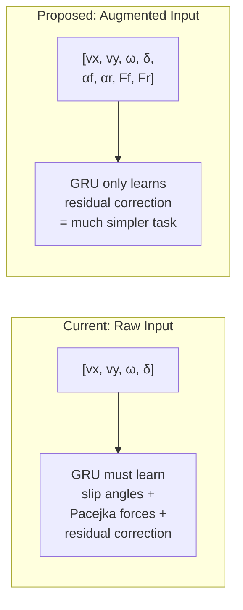
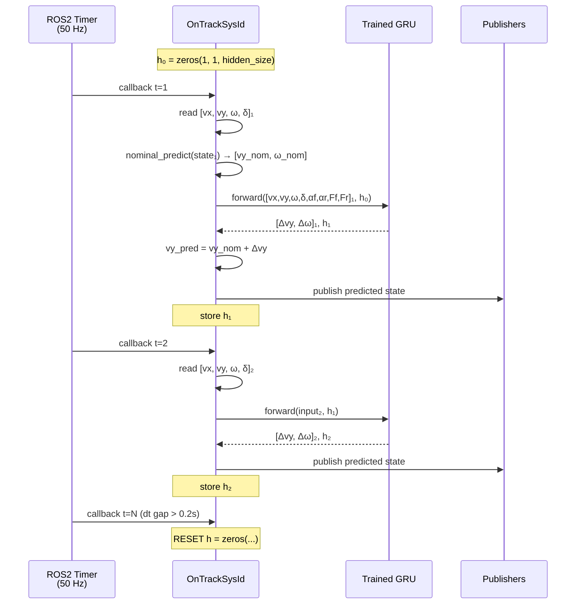
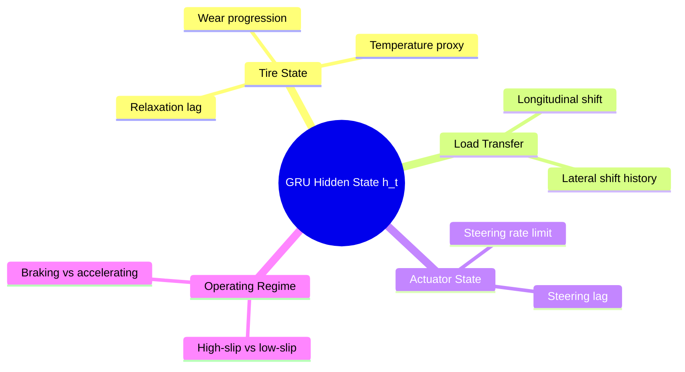
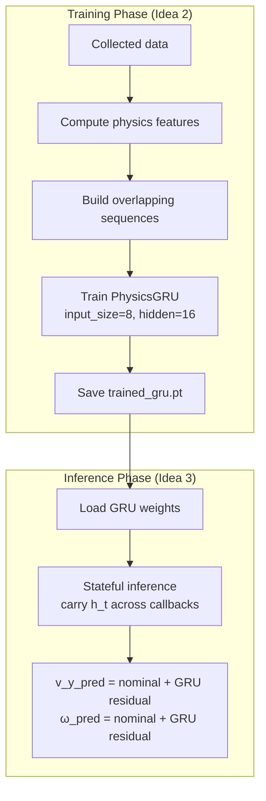

# Detailed Elaboration: Ideas 2 & 3

---

## Idea 2: GRU with Physics-Informed Input Augmentation

### Core Concept

Instead of feeding the GRU only the raw state `[vx, vy, ω, δ]`, you **augment each timestep** with physics-derived quantities that the nominal Pacejka model computes internally. This tells the GRU *"here's what the physics model thinks is happening"* so it only needs to learn the **gap**, not the full dynamics.

### Mathematical Formulation

At each timestep *t* within a sequence, the **augmented input vector** is:

```
z_t = [vx_t, vy_t, ω_t, δ_t, αf_t, αr_t, Ff_t, Fr_t]
       ╰──── raw state ────╯  ╰─physics features─╯
```

Where:

```
αf_t = −arctan((vy_t + ω_t · lf) / vx_t) + δ_t     (front slip angle)
αr_t = −arctan((vy_t − ω_t · lr) / vx_t)            (rear slip angle)

Ff_t = Fzf · Df · sin(Cf · arctan(Bf·αf − Ef·(Bf·αf − arctan(Bf·αf))))
Fr_t = Fzr · Dr · sin(Cr · arctan(Br·αr − Er·(Br·αr − arctan(Br·αr))))
```

The GRU then processes a sequence of these 8-dim vectors:

```
GRU([z_{t-W}, z_{t-W+1}, ..., z_t]) → hidden_t → Linear → [Δvy, Δω]_t
```

### Why This Works Better Than Raw Inputs



1. **Easier learning task**: The GRU doesn't need to internally rediscover how to compute slip angles or tire forces — these are given as inputs. It can focus purely on learning what the physics model **gets wrong**.

2. **Iteration-aware corrections**: Since `Ff` and `Fr` change each iteration (as `C_Pf/C_Pr` update), the GRU sees the **current model's prediction** and learns the delta from it. This means the GRU residual naturally shrinks as the Pacejka params improve.

3. **Better generalization**: If the vehicle enters a slip regime not seen during training, the physics features provide a meaningful extrapolation hint (the Pacejka model gives physically plausible forces), instead of the GRU flying blind.

### Code Sketch: Augmented Input Computation

Where these features would be computed — inside [generate_inputs_errors.py](file:///home/ebrahim/Ebrahim_Master_Thesis_repo/On-Track-SysID/src/helpers/generate_inputs_errors.py):

```python
def compute_physics_features(data, model):
    """Compute slip angles and nominal Pacejka forces for each timestep."""
    vx, vy, omega, delta = data[:, 0], data[:, 1], data[:, 2], data[:, 3]

    l_f, l_r = model['l_f'], model['l_r']
    F_zf = model['m'] * 9.81 * l_r / model['l_wb']
    F_zr = model['m'] * 9.81 * l_f / model['l_wb']

    # Slip angles
    alpha_f = -np.arctan((vy + omega * l_f) / vx) + delta
    alpha_r = -np.arctan((vy - omega * l_r) / vx)

    # Nominal Pacejka forces
    F_f = pacejka_formula(model['C_Pf_model'], alpha_f, F_zf)
    F_r = pacejka_formula(model['C_Pr_model'], alpha_r, F_zr)

    return alpha_f, alpha_r, F_f, F_r
```

Then the inputs tensor becomes 8-dimensional:

```python
inputs = torch.stack([
    vx[:-1], vy[:-1], omega[:-1], delta[:-1],   # raw state (4)
    alpha_f[:-1], alpha_r[:-1], F_f[:-1], F_r[:-1]  # physics (4)
], dim=1)
```

### GRU Model Definition

```python
class PhysicsGRU(nn.Module):
    def __init__(self, input_size=8, hidden_size=16, num_layers=1):
        super().__init__()
        self.gru = nn.GRU(input_size, hidden_size, num_layers, batch_first=True)
        self.fc_out = nn.Linear(hidden_size, 2)  # [Δvy, Δω]

    def forward(self, x_seq, h_0=None):
        # x_seq: (batch, seq_len, 8)
        gru_out, h_n = self.gru(x_seq, h_0)
        # Use last timestep's output for prediction
        last_output = gru_out[:, -1, :]   # (batch, hidden_size)
        residual = self.fc_out(last_output)  # (batch, 2)
        return residual, h_n
```

### Normalization Consideration

> [!IMPORTANT]
> The physics features have very different scales: `αf` ∈ [−0.5, 0.5] rad while `Ff` ∈ [−500, 500] N. You should **normalize all 8 inputs per-feature** (zero mean, unit variance computed from training data) to prevent the GRU from ignoring small-magnitude features.

```python
class InputNormalizer:
    def __init__(self):
        self.mean = None
        self.std = None

    def fit(self, data):
        self.mean = data.mean(dim=0)
        self.std = data.std(dim=0).clamp(min=1e-6)

    def transform(self, data):
        return (data - self.mean) / self.std
```

### Files Changed

| File | Change |
|------|--------|
| [generate_inputs_errors.py](file:///home/ebrahim/Ebrahim_Master_Thesis_repo/On-Track-SysID/src/helpers/generate_inputs_errors.py) | Add `compute_physics_features()`, extend inputs from 4→8 dims |
| `GRU_NN.py` (new) | `PhysicsGRU` class with `input_size=8` |
| [train_model.py](file:///home/ebrahim/Ebrahim_Master_Thesis_repo/On-Track-SysID/src/helpers/train_model.py) | Pass [model](file:///home/ebrahim/Ebrahim_Master_Thesis_repo/On-Track-SysID/src/helpers/train_model.py#154-186) dict into input generation, sequence batching |
| [nn_params.yaml](file:///home/ebrahim/Ebrahim_Master_Thesis_repo/On-Track-SysID/params/nn_params.yaml) | Add `use_physics_features: true` |

---

## Idea 3: Stateful GRU for Online Estimation

### Core Concept

During the **estimation phase** (after training is done), the current code does **memoryless one-step prediction** in [publish_estimates](file:///home/ebrahim/Ebrahim_Master_Thesis_repo/On-Track-SysID/src/on_track_sys_id.py#L223-L323). Each callback independently computes:

```
predicted = nominal_euler_step(current_state)
```

With a stateful GRU, each callback **carries forward a hidden state** from the previous step:

```
(Δvy, Δω), h_new = GRU(current_input, h_previous)
predicted = nominal_euler_step + (Δvy, Δω)
h_previous ← h_new   # persist for next callback
```

### Data Flow at Runtime



### Code Sketch: Integration into [on_track_sys_id.py](file:///home/ebrahim/Ebrahim_Master_Thesis_repo/On-Track-SysID/src/on_track_sys_id.py)

These changes go in the [OnTrackSysId](file:///home/ebrahim/Ebrahim_Master_Thesis_repo/On-Track-SysID/src/on_track_sys_id.py#35-365) class in [on_track_sys_id.py](file:///home/ebrahim/Ebrahim_Master_Thesis_repo/On-Track-SysID/src/on_track_sys_id.py):

**1. Load trained GRU after training completes:**

```python
# In the training_complete branch of loop_callback():
import torch
from helpers.GRU_NN import PhysicsGRU

# Load the trained GRU model
self.gru_model = PhysicsGRU(input_size=8, hidden_size=16)
model_path = os.path.join(self.package_path, 'models',
                          self.racecar_version, 'trained_gru.pt')
self.gru_model.load_state_dict(torch.load(model_path))
self.gru_model.eval()

# Initialize hidden state
self.gru_hidden = torch.zeros(1, 1, 16)  # (num_layers, batch=1, hidden_size)
```

**2. Modified [publish_estimates](file:///home/ebrahim/Ebrahim_Master_Thesis_repo/On-Track-SysID/src/on_track_sys_id.py#223-324) with stateful GRU:**

```python
def publish_estimates(self):
    # ... existing dt checks and state extraction ...

    v_x, v_y_real, omega_real, delta = (
        self.current_state[0], self.current_state[1],
        self.current_state[2], self.current_state[3]
    )
    if v_x < 0.1:
        return

    # ── Nominal prediction (unchanged) ──
    alpha_f = -np.arctan((self.prev_v_y + self.prev_omega * self.l_f) / v_x) + delta
    alpha_r = -np.arctan((self.prev_v_y - self.prev_omega * self.l_r) / v_x)
    F_f = pacejka_formula(self.C_Pf_model, alpha_f, self.F_zf)
    F_r = pacejka_formula(self.C_Pr_model, alpha_r, self.F_zr)

    v_y_dot = (1/self.m) * (F_r + F_f * np.cos(delta) - self.m * v_x * self.prev_omega)
    omega_dot = (1/self.I_z) * (F_f * self.l_f * np.cos(delta) - F_r * self.l_r)

    v_y_nom = self.prev_v_y + v_y_dot * dt
    omega_nom = self.prev_omega + omega_dot * dt

    # ── GRU residual correction (NEW) ──
    gru_input = torch.tensor([[
        v_x, self.prev_v_y, self.prev_omega, delta,
        alpha_f, alpha_r, float(F_f), float(F_r)
    ]], dtype=torch.float32).unsqueeze(0)  # (1, 1, 8)

    with torch.no_grad():
        residual, self.gru_hidden = self.gru_model(gru_input, self.gru_hidden)

    # Apply residual correction
    v_y_pred = v_y_nom + residual[0, 0].item()
    omega_pred = omega_nom + residual[0, 1].item()

    # ... rest of publishing logic unchanged ...
```

**3. Hidden state reset on large gaps:**

```python
# Already exists in current code — extend with GRU reset:
if dt > 0.2:
    self.last_time = self.current_time
    self.prev_v_y = self.current_state[1]
    self.prev_omega = self.current_state[2]
    # Reset GRU memory — temporal context is stale
    self.gru_hidden = torch.zeros(1, 1, 16)
    return
```

### Why Hidden State > Sliding Window at Runtime

| Aspect | Sliding Window (Idea 1) | Stateful GRU (Idea 3) |
|--------|------------------------|-----------------------|
| Memory at runtime | Store last W=15 samples (15×4 floats) | Store hidden state (16 floats) |
| Computation per step | GRU processes 15 timesteps | GRU processes 1 timestep |
| FLOPs per callback | ~15× more | Minimal |
| Temporal horizon | Fixed at W steps | Theoretically unbounded |
| Info from 1s ago | Only if W ≥ 50 | Encoded in hidden state |
| Robustness to gaps | Window may span a gap | Reset hidden on gap detection |

> [!TIP]
> The stateful approach gives you **unbounded temporal memory** compressed into a small hidden vector. In practice, GRUs have an effective memory of ~50-200 steps depending on hidden size, which covers 1-4 seconds at 50 Hz — more than enough for tire dynamics.

### What the Hidden State Learns to Encode

The GRU hidden state `h_t` will learn to internally represent latent quantities that aren't directly measured but affect the residual:



### Files Changed

| File | Change |
|------|--------|
| [on_track_sys_id.py](file:///home/ebrahim/Ebrahim_Master_Thesis_repo/On-Track-SysID/src/on_track_sys_id.py) | Add `self.gru_model`, `self.gru_hidden`; modify [publish_estimates](file:///home/ebrahim/Ebrahim_Master_Thesis_repo/On-Track-SysID/src/on_track_sys_id.py#223-324) to use GRU correction; add hidden state reset logic |
| [train_model.py](file:///home/ebrahim/Ebrahim_Master_Thesis_repo/On-Track-SysID/src/helpers/train_model.py) | Save trained GRU weights to `models/<version>/trained_gru.pt` after training |
| `GRU_NN.py` (new) | Shared model definition used by both training and inference |
| [nn_params.yaml](file:///home/ebrahim/Ebrahim_Master_Thesis_repo/On-Track-SysID/params/nn_params.yaml) | Add `gru_hidden_size`, `use_gru_online: true` |

---

## Combining Ideas 2 + 3 (Recommended)

Ideas 2 and 3 are **complementary** — Idea 2 defines *what the GRU sees*, Idea 3 defines *how it runs at inference*:



They share the **same `PhysicsGRU` class** — the only difference is:
- **Training**: processes batches of sequences with `h_0 = zeros` each batch
- **Inference**: processes one timestep at a time with `h_t` carried forward

---

## Suggested Hyperparameters

```yaml
# nn_params.yaml
model_type: "GRU"
use_physics_features: true     # Idea 2
use_gru_online: true           # Idea 3
sequence_length: 15            # for training sequence construction
gru_hidden_size: 16            # balance: expressiveness vs overfitting on 30s data
gru_num_layers: 1              # single layer — sufficient and fast
lr: 0.001                      # GRUs typically converge faster with slightly higher lr
num_of_epochs: 150             # may need more epochs for sequence learning
```
